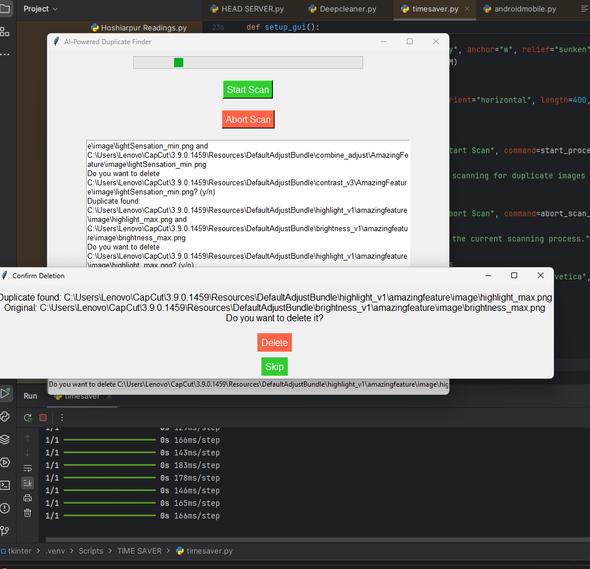
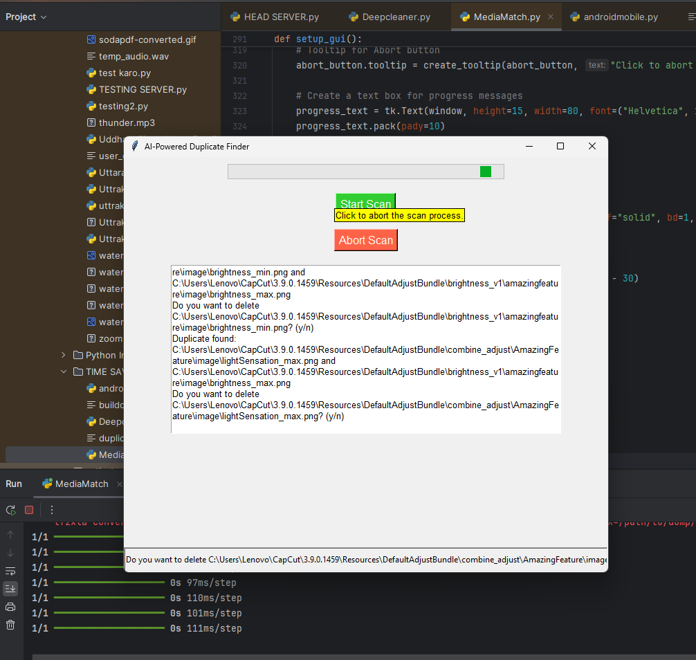
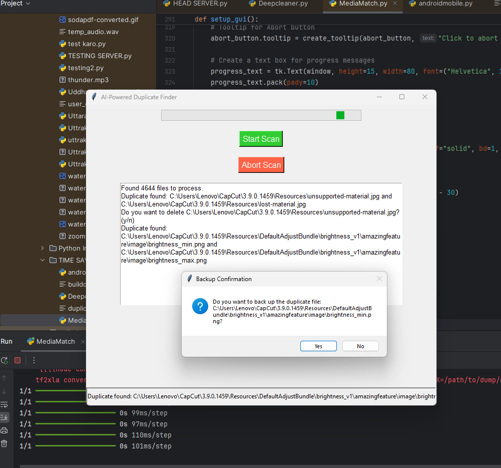
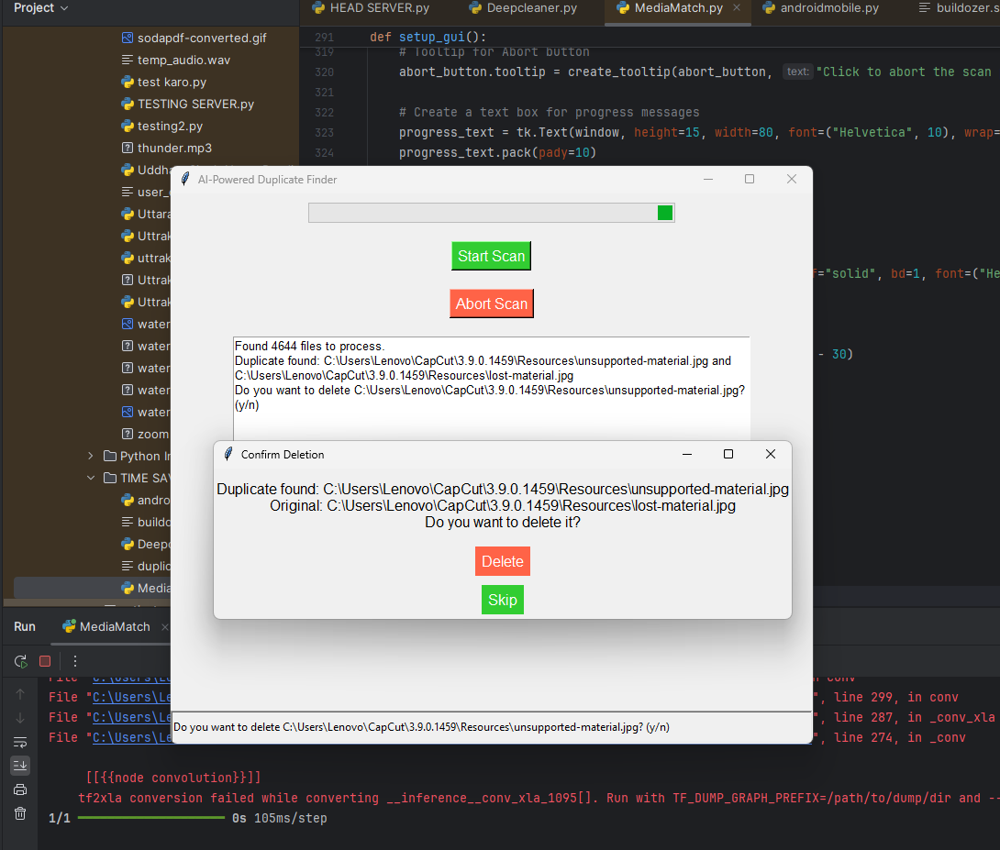

# Media Match: AI-Powered Duplicate Media Cleaner

**Media Match** is an innovative AI-driven tool designed to efficiently detect and remove duplicate images and videos from your system. By leveraging perceptual hashing and advanced AI technology, Media Match goes beyond conventional file-based duplicate finders, identifying even the slightest differences between media files.

Whether you're looking to free up space or streamline your media library, Media Match provides a powerful solution for identifying duplicates with unmatched accuracy.  

## Why Choose Media Match?

- **AI-Powered Duplicate Detection**: Unlike traditional duplicate finders that rely on file names or sizes, Media Match utilizes perceptual hashing algorithms to identify duplicates based on the actual content of images and videos, even if they’ve been edited, resized, or compressed.
- **Cross-Platform Support**: With both desktop and Android versions available, you can clean your media library across all your devices.
- **Customizable Options**: Easily choose whether to delete duplicates automatically or manually confirm which files to keep.
- **Efficient Storage Management**: Save storage space by identifying and removing redundant media files, especially when dealing with large collections of images or videos.
- **User-Friendly Interface**: With a simple, intuitive UI powered by Tkinter (instead of Kivy in this case), Media Match ensures a smooth and effortless experience.
- **Tooltips & Progress Updates**: Get real-time progress tracking and helpful tooltips that guide you through the process. 

## Features

- **Perceptual Hashing**: Detects duplicate images and videos by comparing their content, not just their file names.
- **Dual Support for Images and Videos**: Detects duplicates in both image and video formats (e.g., PNG, JPG, MP4, AVI, and more).
- **Real-Time Progress Tracking**: The tool provides live progress updates as it scans your files, keeping you informed about the process.
- **Manual/Automatic Duplicate Deletion**: Choose whether to delete duplicates automatically or review them before removal.
- **AI-Powered Accuracy**: The AI ensures that even files with minor changes are flagged as duplicates, giving you peace of mind that no unnecessary files remain.
- **Popup Confirmation for Deletion**: A user-friendly confirmation process before deleting any file, allowing for backups and ensuring no important media is lost.
- **Backup Only if Needed**: A customizable setting that enables backup only when necessary, giving you complete control.   
- **Delete Backup After Confirmation**: Once backups are confirmed as safe, you can choose to delete them automatically, further optimizing storage space.

## Getting Started

### Requirements

To get started with Media Match, make sure you have the following dependencies installed:

- Python 3.x
- TensorFlow
- Keras
- OpenCV
- Pillow
- imagehash
- scikit-learn
- Tkinter (for the GUI)

Install them using the following commands:

```bash
pip install tensorflow keras opencv-python pillow imagehash scikit-learn tk
```

### Running the Desktop Version

1. Clone the repository:
   ```bash
   git clone https://github.com/yourusername/Media-Match.git
   ```
2. Navigate to the project directory:
   ```bash
   cd Media-Match
   ```
3. Run the script:
   ```bash
   python MediaMatch.py
   ```

### Running the Android Version

For Android users, download and install the `.apk` file from the releases page, or follow the instructions to run the app directly from the source code via Android Studio.

---

## How It Works

1. **Scanning**: The tool scans your system or selected directories for image and video files.
2. **Hashing**: Each file is hashed using AI-powered perceptual hashing to compare visual content.
3. **Detection**: Duplicate files are detected by comparing their hashes, even if they’ve been resized, cropped, or slightly altered.
4. **User Action**: Once duplicates are identified, users are prompted to confirm if they wish to delete them or not, using a popup window to ensure no file is deleted unintentionally.
5. **Backup and Deletion**: Backup of files is optional and based on user preferences. Duplicates can be deleted after confirming everything is working fine.
6. **Storage Optimization**: Once duplicates are removed and backups are managed, the system storage is freed up, leaving you with only unique files.

---

## Example Usage

```bash
# Start the desktop scanning process
python MediaMatch.py
```

Once started, the tool will scan your system and prompt you to take actions on duplicates it finds. Simply click on "Delete" or "Skip" as needed. You'll also have options to backup duplicates before deletion.

---

## Contributing

We welcome contributions to **Media Match**! If you'd like to contribute, feel free to open issues or submit pull requests. Whether it's improving functionality, fixing bugs, or adding new features, your help is greatly appreciated!

## License

This project is licensed under the MIT License - see the [LICENSE](LICENSE) file for details.

## Contact

For any questions, suggestions, or issues, feel free to open an issue on GitHub, or reach out to the maintainers via the repository.

---

With **Media Match**, you’re not just managing your files—you're optimizing your storage with the power of AI, ensuring a smooth and clutter-free media experience.


